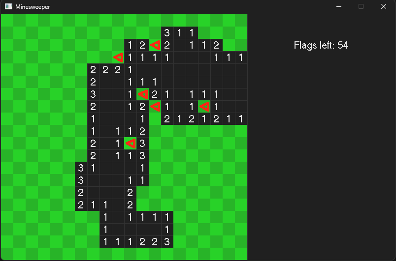
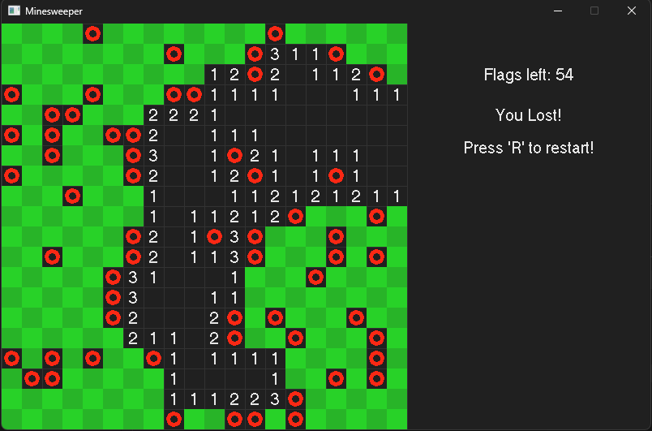

# Minesweeper

A simple minesweeper game in C++

## Building

> To use in windows:

* Run *setup.bat* in the scripts folder
* Open the .sln
* Run desired configuration

> To use in linux: 

* Run '*./scripts/premake5 gmake*' from the root of project
* Run make from the same dir
* cd into the /bin/**output**/**project name**/**project name**
* run ./**project name**
